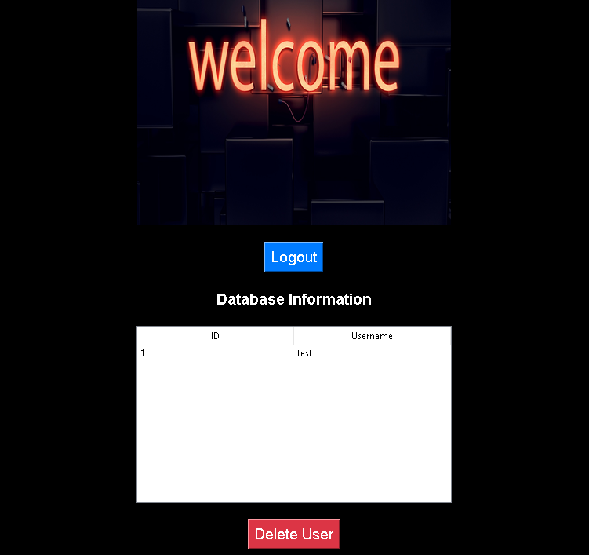

# Register and Login App

## Description
This is a simple Register and Login app built using Python and Tkinter. The app allows users to register with a username and password and login with their credentials. User information is securely stored in an SQLite3 database, ensuring data integrity and confidentiality. If a username is already taken during registration, the app will display an error message. The app also provides a main dashboard where users can view registered users and delete them if needed.

The app features a modern and sleek dark mode user interface, making it easy on the eyes and pleasant to use. It is designed to be responsive, so the layout scales smoothly with the window size.

## Screenshots

## Requirements
Python 3.x
Pillow library (pip install Pillow) 

## How to Use
* Clone the repository: git clone https://github.com/your-username/register-login-app.git
* Navigate to the project directory: cd register-login-app
* Install the required dependencies: pip install Pillow
* Run the app: python main.py

## Contribution
Contributions are welcome! If you find any bugs or have suggestions for improvements, feel free to open an issue or submit a pull request.

## License
This project is licensed under the MIT License.