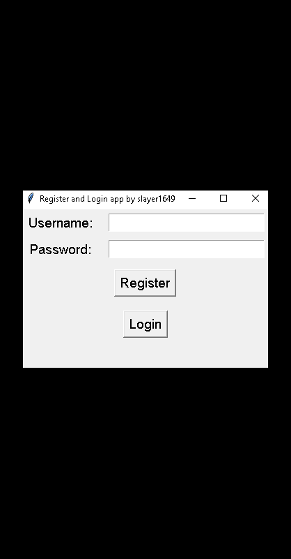

Register and Login App

Overview
This application is a user registration and login system developed using Python and Tkinter. It provides a secure and straightforward way for users to register and log in to access the main app window. The app stores user information in a SQLite database, offering efficient data management.

Features
User Registration: Users can easily create an account by providing a unique username and password.

User Login: Registered users can securely log in to their accounts using their username and password.

Main App Window: Upon successful login, users are presented with the main app window, where they can perform various actions.

Image Display: The main app window displays an image that enhances the user interface experience.

Database Information: Users can browse through the database information, which includes registered users' details.

User Deletion: The app allows administrators to delete users when necessary, ensuring proper user management.

Code Explanation
The app is written in Python and uses the Tkinter library for the graphical user interface. The SQLite database is used to store user information.

License
This project is licensed under the MIT License.

